# The Waffle Truck
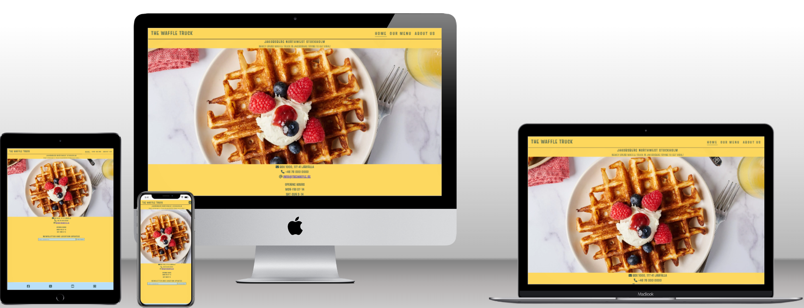
Welcome to The Waffle Truck, your ultimate destination for delicious waffles in Stockholm, Jakobsberg!

## Introduction
The Waffle Truck is a food truck based in Stockholm, Jakobsberg, specializing in serving delicious waffles for breakfast and brunch.

## Features

#### Favicon
* A favicon has been implemented with the company logo and can be seen in the nav for each page
* This will allow the users to identify the website when they have multiple websites open

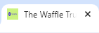

#### Navigation Bar

For mobile phone


For tablets, laptops and desktops

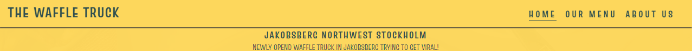
* Consists of a navigation bar for both mobile phones and larger screens. 
* Provides easy access to different sections of the website, enhancing user navigation and experience across various devices.

#### Hero Image and Headings

* Showcases an enticing image related to waffles along with descriptive headings.
* Engages visitors visually and informatively, setting the tone for their experience on the website and encouraging further exploration.

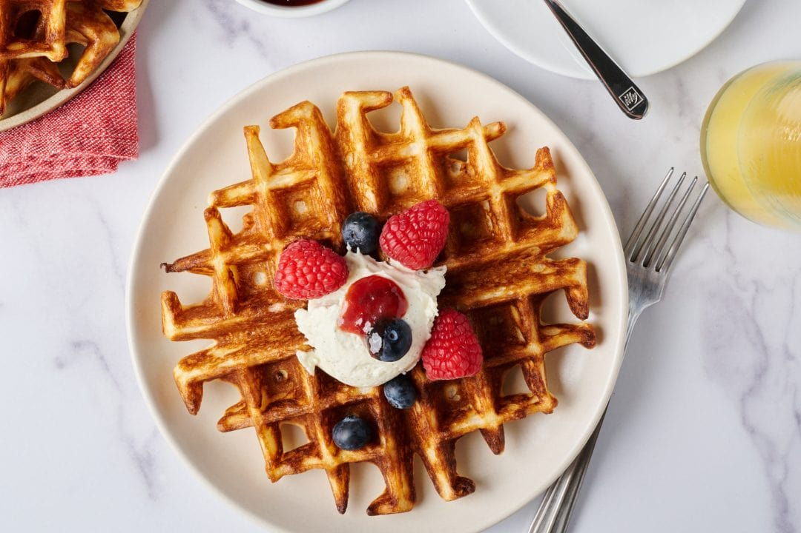

#### Lower Navigation and location with Newsletter form

* Includes a lower navigation section with contact information, opening hours, newsletter subscription form, and updates on today's truck location.
* Offers essential information and engagement opportunities, enhancing user experience and facilitating easy communication with the business. Integration of Aria-labels ensures accessibility for all users, including those using screen readers.

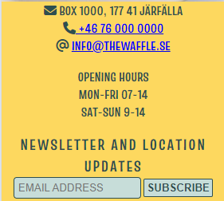

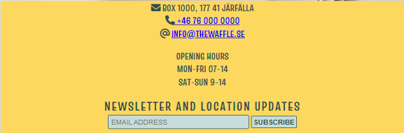

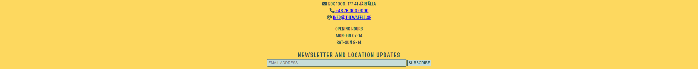


#### Footer

* Contains icons linked to social media websites.
* Encourages social media engagement and interaction, extending the reach of the business. Aria-labels assist visually impaired users in navigating the site effectively, promoting inclusivity and accessibility.

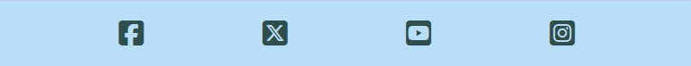

## Technologies

* HTML
    * The structure of the Website was developed using HTML as the main language.
* CSS
    * The Website was styled using custom CSS in an external file.
* Gitpod
    * The site was developed with Gitpod IDE
* GitHub
    * Source code is hosted on GitHub and deployed using Git Pages.
* Git 
    * Used to commit and push code during the development opf the Website
* Font Awesome
    * Icons obtained from https://fontawesome.com/ were used as the Social media links in the footer section. 
* Favicon.io
    * favicon files were created at https://favicon.io/logo-generator/

## Testing

### Responsiveness

All pages have been tested to ensure responsiveness on screen from 320px to 1920px

Steps i went through for testing

1. Open browser and head over to https://oscarbackman92.github.io/Project-1-Oscar-B-ckmanv2/
2. Open Google devtools (right click inspect)
3. Set dimensions to responsive and width to 320px
4. Zoom 50%
5. Click and drag window edges to max width

Expected outcome:

The site is responsive on all screen sizes. Hero image not being pixelated/blurry
Some horizontal is present and that's the idea.

Result:

As expected. The website is responsive to screen sizes and images is working and elements is not compromised.

Tried the website on and Iphone 13 and Iphone 11 with no issues.


### Accessibility

[Wave Accessibility](https://wave.webaim.org/) tool was used in the later stages of development and for final testing of the deployed website to check for any aid accessibility testing.

Testing was focused on accessibility everyone

- All forms have associated labels or aria-labels so that this is read out on a screen reader to users who tab to form inputs
- Color that enhance the elements on the website and instigates a hunger for waffles.
- That all headings have appropriate and meaningful content
- HTML page lang has been set
- Aria labels been implemented correctly and appropriately
- That there is an alt text to images on the website
- WCAG 2.1 Coding best practices being followed

### Lighthouse Testing

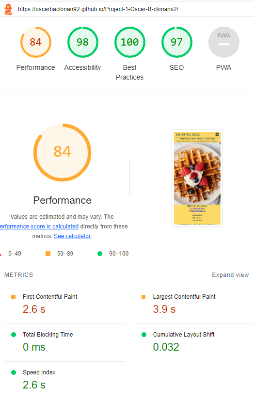

### Version Control

The site was created using the Visual Studio code editor and pushed to github to the remote repository ‘tacos-travels’.

The following git commands were used throughout development to push code to the remote repo:

```git add <file>``` - This command was used to add the file(s) to the staging area before they are committed.

```git commit -m “commit message”``` - This command was used to commit changes to the local repository queue ready for the final step.

```git push``` - This command was used to push all committed code to the remote repository on github.

### Validator

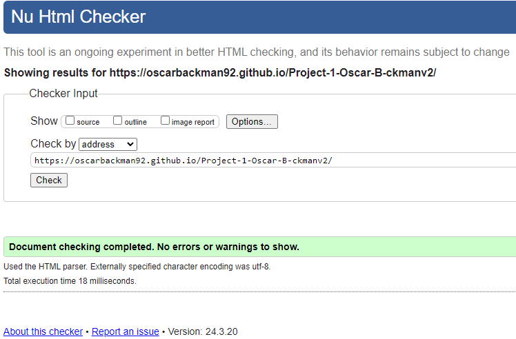

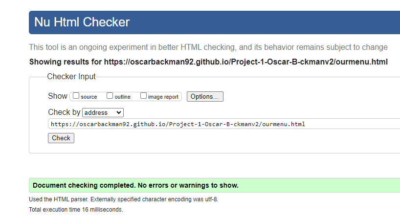

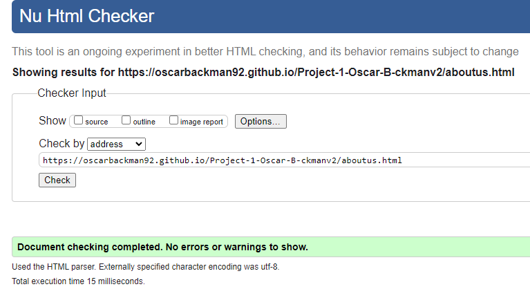

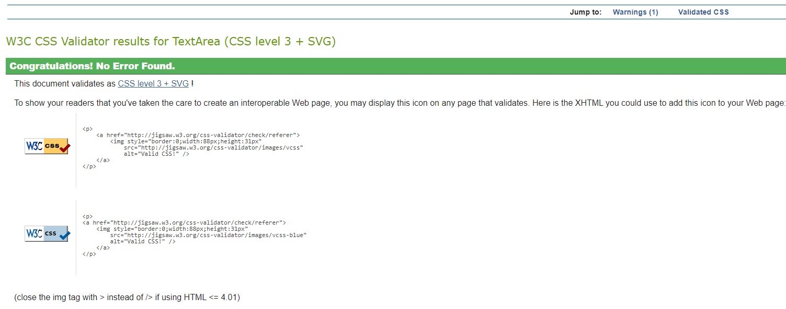

## Deployment

### Deployment to Github Pages

- The site was deployed to GitHub pages. The steps to deploy are as follows: 
  - In the GitHub repository, navigate to the Settings tab 
  - From the menu on left select 'Pages'
  - From the source section drop-down menu, select the Branch: main
  - Click 'Save'
  - A live link will be displayed in a green banner when published successfully. 

The live link can be found here - https://oscarbackman92.github.io/Project-1-Oscar-B-ckmanv2

### Clone the Repository Code Locally

Navigate to the GitHub Repository you want to clone to use locally:

- Click on the code drop down button
- Click on HTTPS
- Copy the repository link to the clipboard
- Open your IDE of choice (git must be installed for the next steps)
- Type git clone copied-git-url into the IDE terminal

The project will now of been cloned on your local machine for use.


## Credits

- My Wife Josefine for the contents in About us and items in our-menu.
- Daisy_mentor for tips and tricks.
- [Gareth Mc](https://github.com/Gareth-McGirr/tacos-travels) for readme inspiration.
- CI for boilerplate and basic structure.


### Content
- Text content was written by [Oscar Bäckman and Josefine Bäckman].

### Media
- Images and videos were sourced from [Image Source](https://www.theperfectloaf.com/my-best-sourdough-waffles/).

### Code
- HTML and CSS code were developed by [Oscar Bäckman] based on design requirements.
- CI for Boilerplate and structure.

### Focus Group
- Feedback and suggestions from focus group participants contributed to the refinement of the website design and features. None other than Oscar Bäckman and Josefine Bäckman and our craving for waffles.
